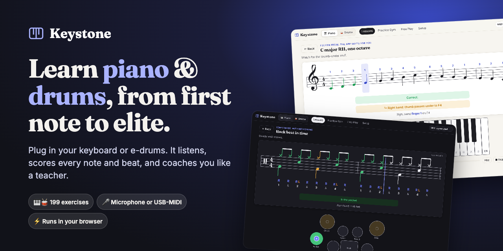
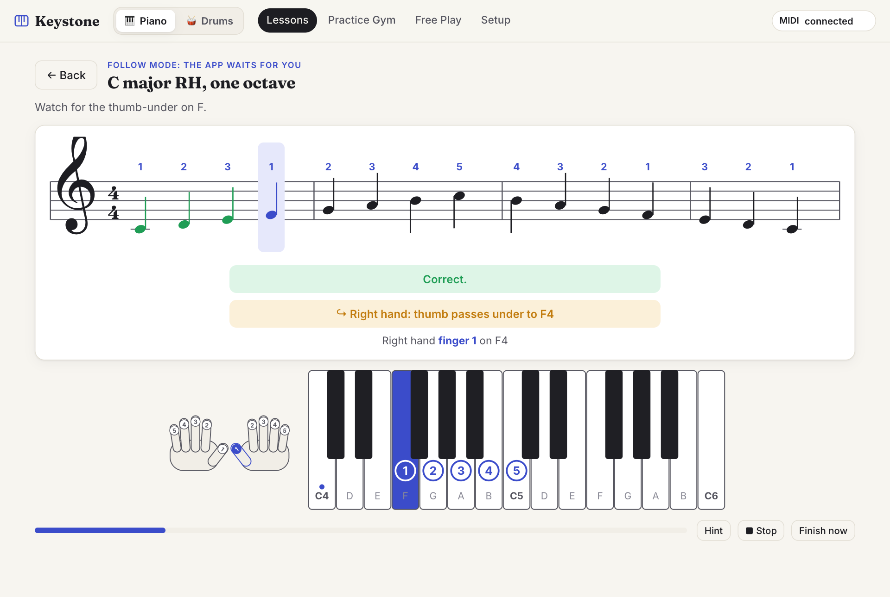
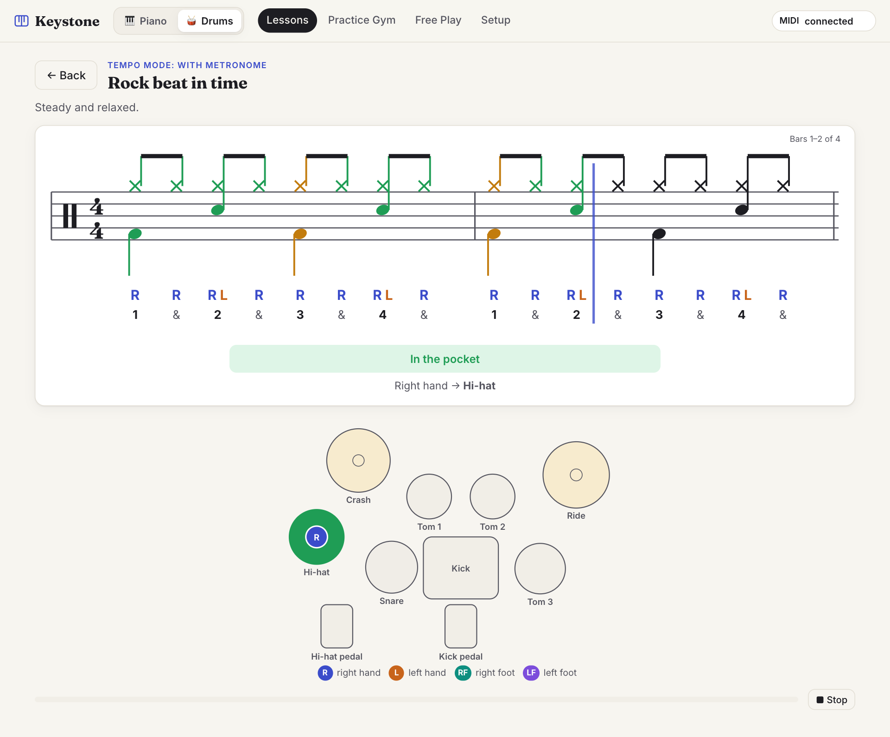
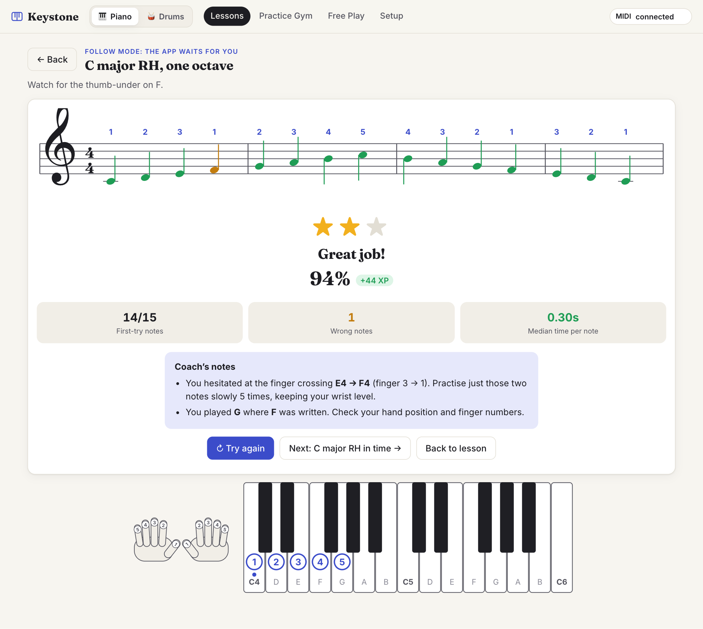
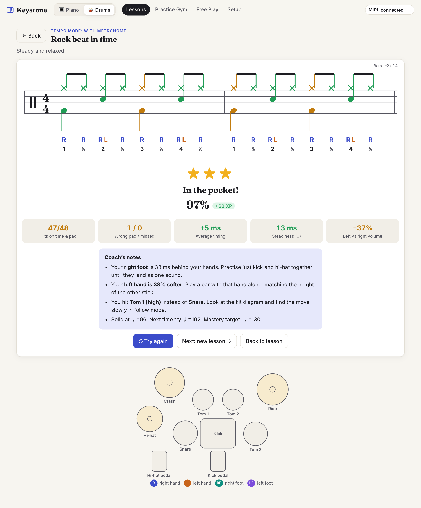

<div align="center">

<a href="https://martha889.github.io/keystone/"></a>

# Keystone

**Learn piano and drums, from your first note to elite level, with a coach that actually listens.**

Plug in your keyboard or electronic drum kit (or just use your microphone). Keystone shows you what to play,<br>
hears what you actually played, and tells you exactly how to get better.

### [▶ Open the app](https://martha889.github.io/keystone/)

[](https://martha889.github.io/keystone/)
[](https://github.com/martha889/keystone/actions/workflows/deploy.yml)


</div>

---

## ✨ Why it's different

- **It listens.** Every note, chord and drum hit is checked in real time, through the microphone or a USB-MIDI cable.
- **It coaches, not just scores.** *“You hesitated at the thumb-under E→F (finger 3 → 1). Practise just those two notes slowly.”* *“Your kick is 32 ms behind your hands.”* *“Your left hand is 37% softer.”*
- **It shows you how.** Finger numbers on every note and key, hand-position cues before every move. On drums: sticking, the count, and the next pad lit up on a kit diagram.
- **It goes all the way.** 20 levels and 199 exercises, from *“find middle C”* to conservatory scales and ♩=180 single-stroke rolls.
- **Zero setup.** It runs in your browser. No account, no install, no server. Your audio never leaves your device.

## 👀 See it in action

<table>
<tr>
<th width="50%">🎹 Piano: fingering &amp; hand-move cues</th>
<th width="50%">🥁 Drums: notation, sticking &amp; live kit</th>
</tr>
<tr>
<td>
<picture>
  <source media="(prefers-color-scheme: dark)" srcset="docs/images/piano-play-dark.png">
  
</picture>
</td>
<td>
<picture>
  <source media="(prefers-color-scheme: dark)" srcset="docs/images/drums-play-dark.png">
  
</picture>
</td>
</tr>
<tr>
<th>Feedback a teacher would give</th>
<th>Timing, per limb, from every hit</th>
</tr>
<tr>
<td>
<picture>
  <source media="(prefers-color-scheme: dark)" srcset="docs/images/piano-results-dark.png">
  
</picture>
</td>
<td>
<picture>
  <source media="(prefers-color-scheme: dark)" srcset="docs/images/drums-results-dark.png">
  
</picture>
</td>
</tr>
</table>

## 🗺️ What you'll learn

| Level | 🎹 Piano (Casio CT-S1, 61 keys) | 🥁 Drums (Alesis Nitro Max) |
| :---: | --- | --- |
| 1 | Foundations: middle C, the keys, finger numbers | Getting started: pads, grip, posture, your feet |
| 2 | Reading music: treble, bass and grand staff | Counting: quarters, eighths, sixteenths, reading |
| 3 | Rhythm & first songs | Rudiments I: singles, doubles, paradiddles, accents |
| 4 | Scales & thumb crossing | First beats: the rock beat and its variations |
| 5 | Chords, inversions & progressions | Fills around the kit |
| 6 | Hands together & repertoire (Bach, Beethoven…) | Hi-hat & independence |
| 7 | All twelve keys | Styles: funk, shuffle, jazz, bossa nova, reggae, 6/8 |
| 8 | Hanon, arpeggios, seventh chords, ii–V–I | Rudiments II: flams, triplets, ghost notes |
| 9 | Advanced performance & sight-reading | Odd time, linear grooves, polyrhythm |
| 10 | **Elite:** all 24 keys, 3 octaves HT at ♩=120 | **Elite:** singles ♩=180, clock tests, four-way coordination |

Plus a **Practice Gym** (any scale, rudiment, groove or reading drill at any tempo), **Free Play** with tempo and evenness analysis, **ear training**, and **Repeat ×1–×8** for longer sessions.

## 🚀 Get started in a minute

1. **Open [martha889.github.io/keystone](https://martha889.github.io/keystone/)** in Chrome or Edge.
2. **Connect your instrument:**
   - **Keyboard:** go to **Setup**. Use the microphone, or plug the keyboard’s USB port into your computer and choose **USB-MIDI** for exact notes.
   - **Drums:** switch to **🥁 Drums → Setup**, plug the drum module’s USB port in and choose **USB-MIDI**.
3. **Press Start** on lesson 1. The app counts you in and coaches you from there.

> 💡 Any MIDI keyboard or e-drum kit works. The lessons are written for the CT-S1’s 61 keys and the Nitro Max layout, and **Teach the app my kit** handles drum modules with custom note maps.

## 🧠 How it works

| | |
| --- | --- |
| **Pitch** | YIN pitch detection with a sub-harmonic guard, plus spectral “rising note” analysis for notes played over ringing ones |
| **Attacks** | Energy rise **and** spectral flux, so fast legato runs and repeated notes register. The metronome click is filtered out of the mic. |
| **Chords** | The app knows what you *should* play, so it verifies each expected note’s partials appear and grow, rather than guessing blind |
| **Fingering** | Dynamic-programming fingering (Parncutt-style comfort costs) for any passage, plus hand-position tracking that detects every thumb-under and shift |
| **Drums** | Every MIDI hit matched to the score by pad and time. Velocity drives accent, ghost-note and hand-balance feedback. |
| **Timing** | Sample-accurate Web Audio metronome. Hits compared to scheduled beats, latency-calibrated in Setup. |

## 💻 Run it locally

```bash
git clone https://github.com/martha889/keystone.git
cd keystone
npm install
npm run dev      # → http://localhost:5173
```

`npm run build` creates a static site in `dist/`. Every push to `main` deploys to GitHub Pages via [`.github/workflows/deploy.yml`](.github/workflows/deploy.yml). To host your own copy, fork the repository and set **Settings → Pages → Source** to **GitHub Actions**.

<details>
<summary><b>Project structure</b></summary>

```
src/
  main.tsx              entry point
  app/                  app shell, routing, global styles
  shared/
    audio/              mic/MIDI input hub, pitch detection, synth + metronome
    store/              progress (XP, stars, streaks) and settings (localStorage)
    components/         level meter, repeat picker, markdown text
  piano/
    music/              theory (spelling, scales, chords, keys) and automatic fingering
    curriculum/         lessons (levels.ts) and exercise builders/generators
    practice/           note matching, scoring and coaching
    components/         staff notation, keyboard, hand diagrams, exercise runner
    pages/              home, lessons, practice gym, free play, setup
  drums/
    engine/             kit + MIDI map, pattern notation, sticking, scoring, drum sounds
    curriculum/         lessons
    components/         drum notation, kit diagram, technique figures, exercise runner
    pages/              home and lessons, practice gym, free play, setup
```

Built with **React 19**, **TypeScript** and **Vite**, using the **Web Audio** and **Web MIDI** APIs. No backend.
</details>

<details>
<summary><b>Good to know</b></summary>

- **Browsers:** Chrome or Edge. Safari doesn’t support Web MIDI.
- **Microphone limits:** USB-MIDI is more reliable than the microphone for very fast passages. On drums, the microphone can only judge timing, not which pad you hit.
- **Fingering:** the app hears *which* keys you play, not *which fingers* you use. Check the numbers shown.
- **Drum notation:** simplified. Rests aren’t drawn; the count under the staff shows the gaps.
- **Your data:** progress lives in your browser’s storage. Export it from Setup to back it up.
</details>
